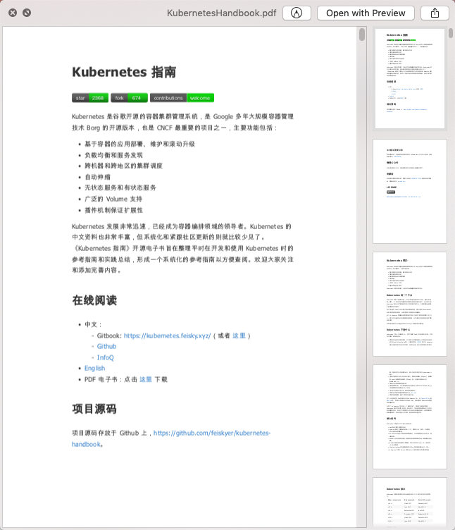
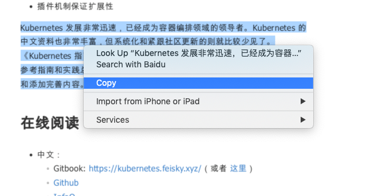
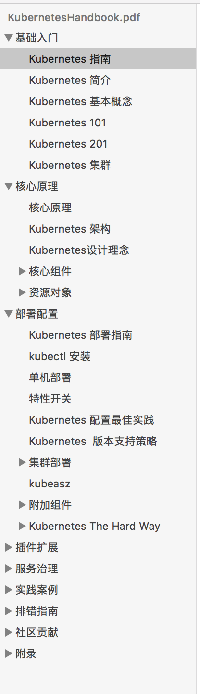
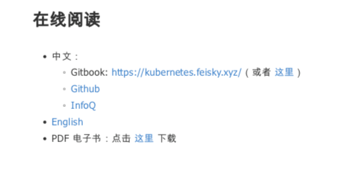

# gitbook2pdf

simple but powerful tools for converting gitbook pages to pdf.



## todolist

- [ ] 加速pdf生成
- [ ] 支持更多格式，比如mobi，equb


## feature

- 文本可复制


- 


- 保留原文链接



- 完整还原原html页面样式
- 体积小，800+页的pdf只占用4.6M


## 使用

### 安装环境

[weastprint安装](https://weasyprint.readthedocs.io/en/latest/install.html#linux)
```python
pip install -r requirements.txt
```
### 运行脚本
```python
python gitbook.py
```

## 示例文件

[KubernetesHandbook.pdf](http://cdn1.xhyuan.co/KubernetesHandbook.pdf)
